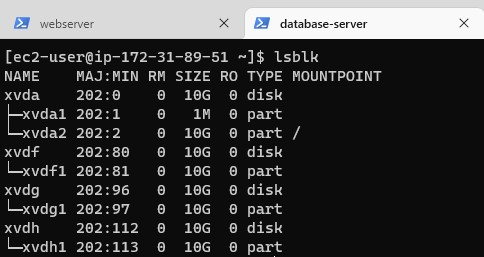
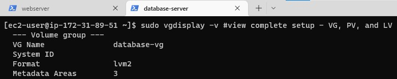

## WEB SOLUTION WITH WORDPRESS

First Step: Prepare a Web Server
1. Launch an EC2 RedHat instance that will serve as webserver and create 3 volumes in the same AZ as the webserver EC2, each of 10 GiB.

2. Attach all the three volumes one by one to your Webserver EC2 instance.

3. Access webserver EC2 instance from the terminal and use lsblk command to display the 3 volumes attached server.

4. Use df -h command to see all mounts and free space on the server.

5. Use gdisk utility to create a single partition on each of the 3 disks. 
- `Run sudo gdisk /dev/xvdf`
- `Run sudo gdisk /dev/xvdg`
- `Run sudo gdisk /dev/xvdh`

6. To view the newly configured partitions on each of the 3 disks use lsblk.

7. Install lvm2 package and check for available partitions

- Run `sudo yum install lvm2`
- Run `sudo lvmdiskscan`

8. Use pvcreate utility to mark each of 3 disks as physical columes (PVs) to be used by LVM.
- Run `sudo pvcreate /dev/xvdf1`
- Run `sudo pvcreate /dev/xvdg1`
- Run `sudo pvcreate /dev/xvdh1`

9. Verify that your Physical volume has been created successfully.
- Run `sudo pvs`

10. Use vgcreate utility to add all 3 PVs to a volume group (VG). Name the VG as webdata-vg and verify that the VG has been created.
- Run `sudo vgcreate webdata-vg /dev/xvdh1 /dev/xvdg1 /dev/xvdf1`
- Run `sudo vgs`

11. Create 2 logical volumes - apps-lv (use half of the PV size) and logs-lv (use the remaing space of the PV size)
using lvcreate command. Files for the website will be stored in apps-lv and logs-lv will be used to store data for logs. Verify that the logical volumne has been created.
- Run `sudo lvcreate -n apps-lv -L 14G webdata-vg`
- Run `sudo lvcreate -n logs-lv -L 14G webdata-vg`
- Run `sudo lvs`

12. Verify the entire setup.
- Run `sudo vgdisplay -v #view complete setup - VG, PV, and LV`
- Run `sudo lsblk`

13. Format the logical volumes with ext4 filesystem using mkfs.ext4.
- Run `sudo mkfs -t ext4 /dev/webdata-vg/apps-lv`
- Run `sudo mkfs -t ext4 /dev/webdata-vg/logs-lv`

14. Create /var/www/html directory to store website files and create /home/recovery/logs to store backup of log data.
- Run `sudo mkdir -p /var/www/html`
- Run `sudo mkdir -p /home/recovery/logs`

15. Mount  apps-lv logical volume on /var/www/html. Use rsync utlility to backup all the files in the log directory /var/log into /home/recovery/logs (this is required before mounting the file system).
- Run `sudo mount /dev/webdata-vg/apps-lv /var/www/html`
- Run `sudo rsync -av /var/log/. /home/recovery/logs/`

16. Mount logs-lv logival volume on /var/log (This implies that all the existing data on /var/log will be deleted). Then restore log files back into /var/log directory.
- Run `sudo mount /dev/webdata-vg/logs-lv /var/log`
- Run `sudo rsync -av /home/recovery/logs/. /var/log`

17. Get the UUID of the device that will be used to update the /etc/fstab file so that the mount configuration will persist after restart of the server. Then update /etc/fstab in the right format with the obtained UUID.
- Run `sudo blkid`
- Run `sudo vi /etc/fstab`

18. Test the configuration and reload the daemon then verify setup.
- Run `sudo mount -a` 
- Run `sudo systemctl daemon-reload`
- Run `df -h`

Second Step: Prepare the Database Server.
1. Launch a second EC2 RedHat instance that will serve as database-server and create 3 volumes in the same AZ as the database-server, each of 10 GiB. Then attach all the three volumes one by one to your Webserver EC2 instance.

2. Access database-server EC2 instance from the terminal and use lsblk command to display the 3 volumes attached server.

4. Use df -h command to see all mounts and free space on the server.

5. Use gdisk utility to create a single partition on each of the 3 disks. 
- Run `sudo gdisk /dev/xvdf`
- Run `sudo gdisk /dev/xvdg`
- Run `sudo gdisk /dev/xvdh`

6. To view the newly configured partitions on each of the 3 disks use lsblk.

7. Install lvm2 package and check for available partitions

- Run `sudo yum install lvm2`
- Run `sudo lvmdiskscan`

8. Use pvcreate utility to mark each of 3 disks as physical columes (PVs) to be used by LVM.
- Run `sudo pvcreate /dev/xvdf1`
- Run `sudo pvcreate /dev/xvdg1`
- Run `sudo pvcreate /dev/xvdh1`

9. Verify that your Physical volume has been created successfully.
- Run `sudo pvs`

10. Use vgcreate utility to add all 3 PVs to a volume group (VG). Name the VG as database-vg and verify that the VG has been created.
- Run `sudo vgcreate database-vg /dev/xvdh1 /dev/xvdg1 /dev/xvdf1`
- Run `sudo vgs`

11. Create 2 logical volumes: db-lv (use half of the PV size) and logs-lv (use the remaing space of the PV size)
using lvcreate command. Files for the database will be stored in db-lv and logs-lv will be used to store data for logs. Verify that the logical volumne has been created.
- Run `sudo lvcreate -n db-lv -L 14G database-vg`
- Run `sudo lvcreate -n logs-lv -L 14G database-vg`
- Run `sudo lvs`

12. Verify the entire setup.
- Run `sudo vgdisplay -v #view complete setup - VG, PV, and LV`
- Run `sudo lsblk`

13. Format the logical volumes with ext4 filesystem using mkfs.ext4.
- Run `sudo mkfs -t ext4 /dev/database-vg/db-lv`
- Run `sudo mkfs -t ext4 /dev/database-vg/logs-lv`

14. Create /db directory to store database files and create /home/recovery/logs to store backup of log data.
- Run `sudo mkdir -p /db`
- Run `sudo mkdir -p /home/recovery/logs`

15. Mount  db-lv logical volume on /db. Use rsync utlility to backup all the files in the log directory /var/log into /home/recovery/logs (this is required before mounting the file system).
- Run `sudo mount /dev/databse-vg/db-lv /db`
- Run `sudo rsync -av /var/log/. /home/recovery/logs/`

16. Mount logs-lv logival volume on /var/log (This implies that all the existing data on /var/log will be deleted). Then restore log files back into /var/log directory.
- Run `sudo mount /dev/database-vg/logs-lv /var/log`
- Run `sudo rsync -av /home/recovery/logs/. /var/log`

17. Get the UUID of the device that will be used to update the /etc/fstab file so that the mount configuration will persist after restart of the server. Then update /etc/fstab in the right format with the obtained UUID.
- Run `sudo blkid`
- Run `sudo vi /etc/fstab`

18. Test the configuration and reload the daemon then verify setup.
- Run `sudo mount -a`
- Run `sudo systemctl daemon-reload`
- Run `df -h`

Third Step: Install WordPress on your webserver EC2 instance
1. Update the repository on the webserver and install wget, Apache and it's dependencies.
- Run `sudo yum -y update`
- Run `sudo yum -y install wget httpd php php-mysqlnd php-fpm php-json`

2. Start Apache.
- Run `sudo systemctl enable httpd`
- Run `sudo systemctl start httpd`

3. To install PHP and it’s depemdencies.
- EPL repository -Run `sudo yum install https://dl.fedoraproject.org/pub/epel/epel-release-latest-8.noarch.rpm`
- remi repository -Run `sudo yum install yum-utils http://rpms.remirepo.net/enterprise/remi-release-8.rpm`
- Run `sudo yum module list php`
- Run `sudo yum module reset php`
- Run `sudo yum module enable php:remi-7.4`
- Run `sudo yum install php php-opcache php-gd php-curl php-mysqlnd`
- Run `sudo systemctl start php-fpm`
- Run `sudo systemctl enable php-fpm`
- Run `sudo su` followed by `setsebool -P httpd_execmem 1`

4. Restart Apache and download WordPress and copy wordpress to var/www/html.
- Run `mkdir wordpress && cd wordpress`
- Run `sudo wget http://wordpress.org/latest.tar.gz`
- Run `sudo tar xzvf latest.tar.gz`
- Run `sudo rm -rf latest.tar.gz`
- Run `cp wordpress/wp-config-sample.php wordpress/wp-config.php`
- Run `sudo cp -R wordpress/. /var/www/html`
- Run `sudo ls -l /var/www/html`

5. Configure SELinux Policies.
- Run `sudo chown -R apache:apache /var/www/html/`
- Run `sudo chcon -t httpd_sys_rw_content_t /var/www/html/ -R`
- Run `sudo setsebool -P httpd_can_network_connect=1`

Forth Step: Install MySQL on your DB Server EC2
1. From DB Server terminal install mysql server and verify that it is up and running. If it is not running, restart the service and enable it so it will be running even after reboot
- Run `sudo yum update -y`
- Run `sudo yum install mysql-server -y`
- Run `sudo systemctl status mysqld`
- Run `sudo systemctl restart mysqld`
- Run `sudo systemctl enable mysqld`

Fifth Step: Configure DB to work with WordPress
1. From the database server terminal use the following commands:
- Run `sudo mysql`
- `CREATE DATABASE wordpress;` 
- `CREATE USER `myuser`@`<Web-Server-Private-IP-Address>` IDENTIFIED BY 'mypass';`
- `GRANT ALL ON wordpress.* TO 'myuser'@'<Web-Server-Private-IP-Address>';`
- `FLUSH PRIVILEGES;`
- `SHOW DATABASES;`
- `exit`

Sixth Step: Configure WordPress to connect to remote database.
1. Open mysql on port 3306 on DB Server EC2 in the inbound rule and allow only connection from webserver's IP address and specify source as /32 for extra security.

2. From the terminal of webserver, install mysql client and test that you can connect from the webserver to your DB server by using mysql-client. Then  verify that the list of exisitng databases are accessible.
- Run `sudo yum install mysql`
- Run `sudo mysql -u myuser -p -h <DB-Server-Private-IP-address>`
- Run `SHOW DATABASES;` 

3. Change permissions and configuration so Apache could use WordPress:
- Run `sudo su` followed by `setsebool -P httpd_execmem 1`
- Run `sudo systemctl restart httpd`

4. Enable TCP port 80 in Inbound Rules configuration for your Web Server EC2 (enable from everywhere 0.0.0.0/0 or from your workstation’s IP).

5. Try to access from your browser the link to your WordPress.

- Access from the browser `http://<Web-Server-Public-IP-Address>`

  

